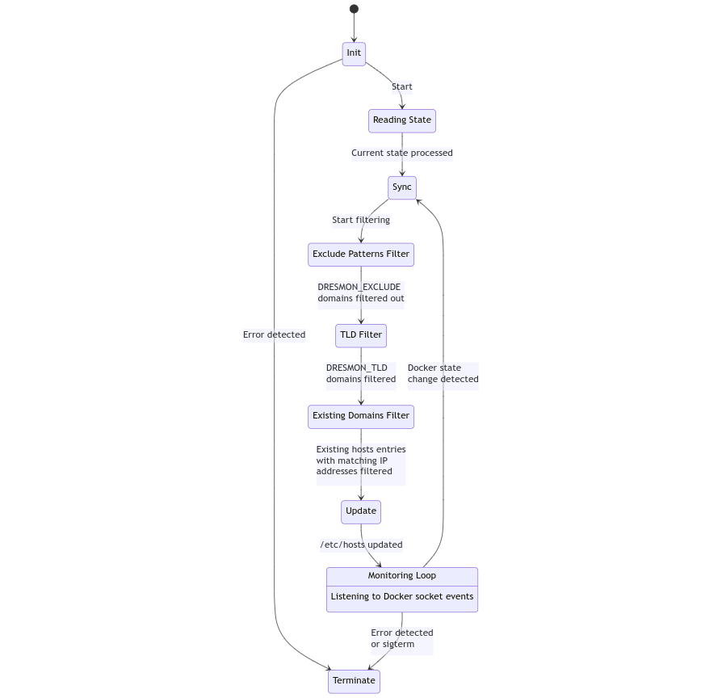

# Dresmon

Keeps /etc/hosts sync with docker state.

**Dresmon stands for:**

* D - DNS
* RES - resolving
* MON - monitor

## Description
Dresmon is a tool designed to keep your /etc/hosts file in sync with the state of your Docker containers. It ensures that as containers start, stop, or change their state, the /etc/hosts file is updated accordingly, allowing for seamless localhost DNS resolution of containerized applications on your host.

## Inspiration
This project was inspired by discussions in the developer community about the need for a tool that bridges the gap between Docker's dynamic nature and the static nature of the /etc/hosts file. Further inspiration was drawn from projects like JWilder Nginx-Proxy and Traefik.

For a detailed list of inspirations, please refer to CREDITS.md.

## Prerequisites

### On Host

* Docker installed and running.
* Python 3.x
* Appropriate permissions to modify the /etc/hosts file.

### In a Docker Container

* Docker daemon accessible (usually via Docker-in-Docker or mounting the Docker socket).
* Python 3.x (included into a prebuilt image and also added as a dependency to install in Dockerfile)

## Usage

### Usage on Host

1. Clone the repository:

    ``` bash
    git clone https://github.com/PapevisO/dresmon.git
    ```

1. Navigate to the project directory:

    ``` bash
    cd dresmon
    ```

1. Build and Run
    1. Using Docker Compose with pre-built image:

        * Update the docker-compose.yml to use the image from Docker Hub:

        ``` yaml
        services:
          dresmon:
            image: papeviso/dresmon:latest
            volumes:
              - /var/run/docker.sock:/var/run/docker.sock:ro
              - /etc/hosts:/etc/hosts
        ```

        * Run using Docker Compose:

        ``` bash
        docker-compose up -d dresmon
        ```

        or if it's the only service in your project

        ``` bash
        docker-compose up -d
        ```

    1. Using Docker Compose with manual separately from the project build:

        * Build the image:

        ``` bash
        docker build -t dresmon .
        ```

        * Update the docker-compose.yml to use the locally built image:

        ``` yaml
        services:
          dresmon:
            image: dresmon
            volumes:
              - /var/run/docker.sock:/var/run/docker.sock:ro
              - /etc/hosts:/etc/hosts
        ```

        * Run using Docker Compose:

        ``` bash
        docker-compose up -d dresmon
        ```

    1. Using Docker Compose with Compose managed build:
        * Clone Dresmon repository to project subdirectory:

        ``` bash
        git clone https://github.com/PapevisO/dresmon.git
        ```

        * Update the docker-compose.yml to use the locally built image:

        ``` yaml
        services:
          dresmon:
            build: dresmon
            volumes:
              - /var/run/docker.sock:/var/run/docker.sock:ro
              - /etc/hosts:/etc/hosts
        ```

        * Build the image:

        ``` bash
        docker-compose up -d --build dresmon
        ```

1. Monitor the logs to ensure Dresmon is functioning as expected:

``` bash
docker-compose logs -f
```

### Usage with Docker

1. Pull the Dresmon image:

    ``` bash
    docker pull papeviso/dresmon
    ```

1. Run the Dresmon container, ensuring the Docker daemon is accessible:

    ``` bash
    docker run \
        -v /var/run/docker.sock:/var/run/docker.sock \
        -v /etc/hosts:/etc/hosts \
        papeviso/dresmon
    ```

1. Alternatively, you can build the image inside another Docker container and run it similarly.

## Environment Variables

* `DRESMON_EXCLUDE`: Domains to exclude from being added to /etc/hosts. Supports wildcard patterns. Delimitered by comma.
* `DRESMON_TLD`: Top-level domains that Dresmon should manage. Delimitered by comma. Useful for filtering out unwanted domains.

## Links

1. GitHub Repository
    https://github.com/PapevisO/dresmon

1. Docker Hub
    https://hub.docker.com/r/papeviso/dresmon

## State transition diagram



[Diagram source on Mermaid](https://mermaid.live/edit#pako:eNp9VN9v2jAQ_lcsP06Uhh-B4Ie9FKZVgq0qrTRtmSYrNmCN2Mh2traI_71nOxCSWctLzr7v--5yd7kjLhTjmGBjqeVzQbealrlE8PgblON7KWyOETXIWYLuxRu1Qsk26pFTJuQWrd05wOuru0prLm1wtDgrBYJKO9pSqUNgNZdt8PpVFgHhrH_ci5diXzGOHqi1XEuDPok9GIER7PnjYr36-uXX4tvd8nm-aPOflvP_UMDbDSeMdYnPVUlFNNwZUiPa_OcDu9Qp2J-VsR3QE9elkBfcQmul87ruPz78RDc3H6M9ad95WKQXxPVK20CJ-D2vrjVBtafO7aBVwY3h7JxO0zWClvDdXLriWAX1KX5zjYx7WcT_gIbpUtqRzoxQBMAWOyq3HDFueWGbkDXBk6MNrj8QbbzzMjFRbEQFeg7JdGAuH1a3POhyhlRlY9JupBrZzjg00g4Wk72W7JC97NXYEHSZx507I6iyFtx43b_C7lBJbbFz_vsHf0kZ066B3XBXoj7IdV9vuS1ug37lYZdWRAbODysJr6vWRRofRfok4WzEFrKDjYR7uASDCgbL6uiEcmx3vIR_g4DJ-IZWe9hTuTwBlFZWufnAxOqK93DIt15vmGzo3sAtZy6PVViAfg_28IHK70qVZyIcMTniF0yGg1F_lo4n01GSjeEwTnv4FZNBOuwPklmSptNpNs6GWXrq4TevkPQnaTqYzCbJZJhkWTIYnd4BBmnRmQ)
